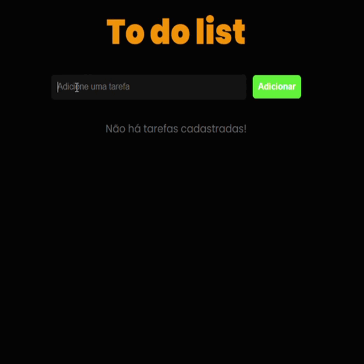

<h1 align="center"> To-do list 📋
  
  

</h1>

<h1 align="center"><a href="https://iambiancasouza.github.io/to-do/">See me here 😉</a></h1>

## About

Finally, my creator decided to remember to make me, apparently I wasn't a priority on her to-do list. 😪

Anyway, as you can see, I'm a to-do list, just like thousands of others already out there.
Add tasks, remove them, and by clicking on the tasks, they become marked as completed, which can be reversed by clicking again.

## How do I work? 

Click on task = task done
Remove = remove
Add task = click add or enter key.

As simple as that.

## Tools used on me

* HTML
* CSS
* REACT
* JAVASCRIPT

